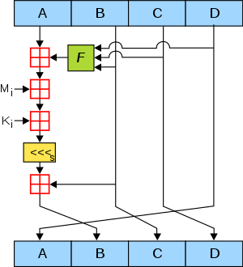

## AES

- [준문서](https://csrc.nist.gov/files/pubs/fips/197/final/docs/fips-197.pdf)

* Rijndael 알고리즘 채택

  - Rijndael 알고리즘은 크게 보아 네단계 수행

    1. Key Expansion

       - 128, 192 또는 256비트 길이인 하나의 주 암호화 키를 받아서 아래 라운드들에서 사용할 여러 개의 128비트 라운드 키를 생성.

    2. 0 라운드

       - 위의 단계에서 생성한 라운드 키 중 첫번째 키를 사용, AddRoundKey를 한 번 실행.

    3. 1~(9, 11, 13) 라운드

       - SubBytes, ShiftRows, MixColumns, AddRoundKey를 순서대로 실행. 이것을 AES-128, 192, 256에 따라 각각 9번, 11번, 13번 반복.

    4. 마지막 (10, 12, 14)번째 라운드

       - SubBytes, ShiftRows, AddRoundKey를 순서대로 실행한다.

* S-box

  - 바이트의 앞쪽 4비트 -> 행
  - 바이트의 뒤쪽 4비트 -> 열
  - 해당 행&열의 값으로 바꿈

* SubBytes

  - State의 각 바이트를 S-box에 따라 다른 바이트로 substitution

  * 2^8 가지의 입력값이 존재하여 2^8가지의 출력값이 존재

  * 비선형을 제공 -> 차분 공격, 선형 공격에 저항성을 가짐

* ShiftRows

  - 확산 효과를 제공

  * 128비트=16바이트 블럭을 4x4 바이트 행렬로 봄.

  - 4개의 행은 각각 왼쪽으로 Shift.

  - 16바이트를 행 우선으로 배열한 다음, 두번째 줄은 왼쪽으로 한 칸, 세번째 줄은 두 칸, 네번째 줄은 세 칸 만큼 민다. 첫번째 줄은 변화가 없다.

* MixColumns

* AddRoundKey

  - 128비트 블럭에 128비트 라운드 키(네 워드를 이어붙여 만든)를 XOR한다.

* AES 암호화된 결과 데이터는 이진 데이터이기 때문에 데이터 교환 시 불편한 경우가 많아 대부분 암호화된 결과 데이터를 BASE64로 인코딩해서 나온 플레인 텍스트를 사용

* 컴퓨터 파일이나 각종 디스크 암호화에 적절한 암호화 방식

* AES가 블럭 암호화 알고리즘인 만큼 다른 모든 블럭 암호화 알고리즘처럼 패딩(padding)하여 블럭의 빈 자리를 채울 필요가 있음. 일반적으로 PKCS#5와 PKCS#7에 정의된 패딩 알고리즘이 널리 사용.

### ECB (Electronic Code Block)

- 가장 단순한 모드로 블록단위로 순차적으로 암호화 하는 구조.

* 한 개의 블록만 해독되면 나머지 블록도 해독이 되는 단점. (Brute-Force Arttack, Dictionary Attack)

* 암호문이 블록의 배수가 되기 때문에 복호화 후 평문을 알기 위해서 Padding을 해야한다.

### BCM (Block Cipher Mode)

### CBC (Cipher Block Chaining)

## MD5 (Message-Digest algorithm 5)

- 128비트의 고정 길이 출력.
- 입력 메시지는 512비트 블록으로 나누어짐.
  - 이 때, 패딩을 사용하여 512비트로 맞추어 나눠질 수 있게함.
  - e.g.
    |input|bit1|bit2~|나머지 64비트|
    |:--:|:--:|:--:|:--:|
    |data|1|0|data length(little endian)|

* A,B,C,D로 이름을 붙인 32비트 워드 버퍼 네개로 이루어진 하나의 128비트 스테이트(state)에 대해 동작한다.
* A,B,C,D는 소정의 상수값으로 초기화된다.
* MD5는 리틀 엔디언 방식으로 구현을 해야하는 알고리즘
* 512비트의 블록을 처리하기 위해 4개의 부울함수로 구성된 함수를 사용
* 해당 함수를 거치면 4개의 32비트 워드가 32비트로 출력
  - e.g.
    ```
    #define F(x, y, z) ((x & y) | (~x & z))
    #define G(x, y, z) ((x & z) | (y & ~z))
    #define H(x, y, z) (x ^ y ^ z)
    #define I(x, y, z) (y ^ (x | ~z))
    ```
* 하나의 메시지 블록(512bit)을 처리하는 것은 총 4라운드(128bit 씩처리)로 구성되어 수행.

* 각 라운드는 비선형함수 F(F, G, H, I 순으로), 모듈로 덧셈, 레프트 로테이션에 기반한 16개의 동일연산.

* 

* Mi 는 입력 메시지의 i번째 32bit 블록.

* Ki는 4294967296 \* abs(sin(i)) 의 정수부분. (i는 라디안, 0<= i <= 63) (abs는 절대값)

* K값은 미리 계산이 가능하기 때문에 메모리가 여유 있으면 속도를 위해서 미리 계산한 값을 사용하기도 함.

* <<<s 는 s만큼의 레프트 로테이션, 마지막은 모듈로 2^32 덧셈(덧셈 후 mod 2^32 )이다.

* collisions결함으로 인해 sha 사용

## SHA-2

- [SHA-2]('./SHA-2.md')
